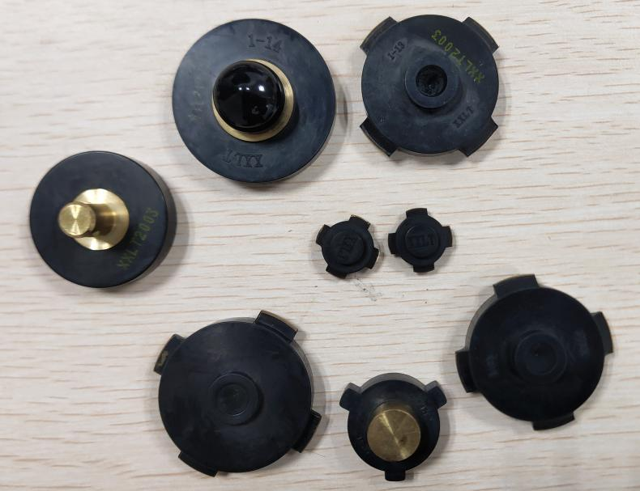
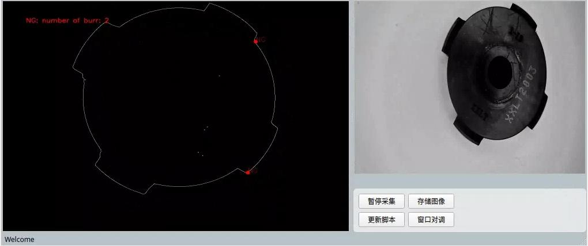
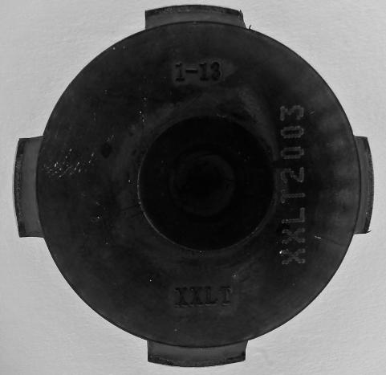
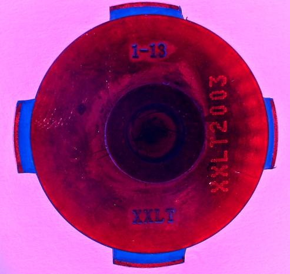
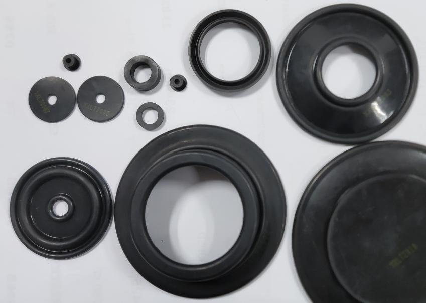

# 河北新旭龙腾-注塑件外观检测方案

## 产品类型

### 橡胶阀

尺寸范围：

+ 直径：20~50mm
+ 高度：7~20mm
+ 橡胶厚度：5~8mm

检测内容：

1. 橡胶外轮廓的毛刺（已实现）
2. 文字OCR识别（可实现）

检测方式：

1. 通过底板光源或直射光，识别阀门轮廓线
2. 验证轮廓的梯度，实现对凸起的检测

相机像素：500万

限制条件：

1. 由于阀门的“翅膀”可能会遮挡另一侧的缺陷，建议使用上下双摄像头方案或翻转机构进行双侧检查。
2. OCR文字识别需要通过彩色镜头和颜色光突出字符（目前不支持中文）。

    

    

### 橡胶垫

尺寸范围：

+ 长宽：
    + 190x100mm
    + 120x90mm
+ 厚度：2.5~6.5mm

检测内容：

1. 橡胶孔的毛刺（已实现）
2. 筋的断裂和损坏（需要通过3D方案实现）

检测方式

1. 毛刺检测同上
2. 由于筋的材料与其他位置相同，2D相机难以辨识。使用3D相机则可以轻松检测到筋在高度上的变化，实现对断裂等缺陷的检测。

相机像素：2000万

限制条件：

1. 由于有些直径的尺寸相对橡胶厚度，可能会导致阴影，对光照条件要求较高
2. 高分辨率相机可能导致运算效率、节拍更慢
3. 大的视野范围需要考虑镜头畸变导致的问题

### 橡胶圈

尺寸范围：

+ 橡胶圈直径：15~120mm
+ 线粗：2.5~4mm

检测内容：

1. 毛刺
2. 粘胶
3. 缺胶
4. 裂口

限制条件：

1. 由于橡胶环本身较细，而材料又可能存在较大形变。环扭转后可能覆盖掉较为细小的毛边。需要通过机构扭转橡胶圈到多个角度。
2. 自然状态下，无法实现对裂口的检测。同样需要通过机构牵引橡胶圈才能突出裂口的状态。

### 橡胶盘、橡胶套

尺寸范围：

+ 外径：10~100mm
+ 高度/厚度：6~35mm

检测内容：

1. 毛边

检测原理同上。

相机像素：2000万

限制条件：

1. 视野过大同样需要考虑高分辨率的问题。
2. 高度过大时需要考虑阴影导致的影响。
3. 更大的高度差以及景深能否支持准确的轮廓锐度。
