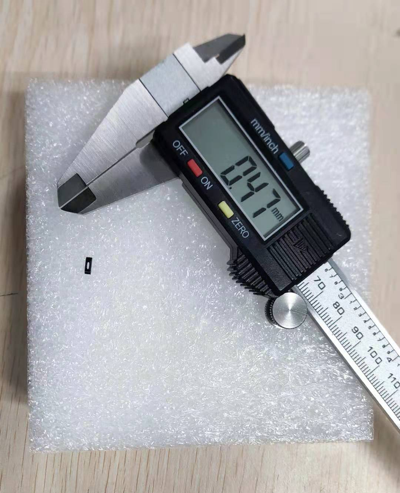
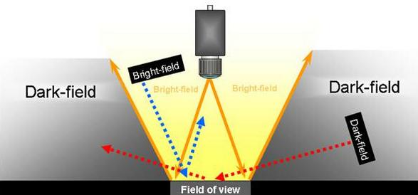
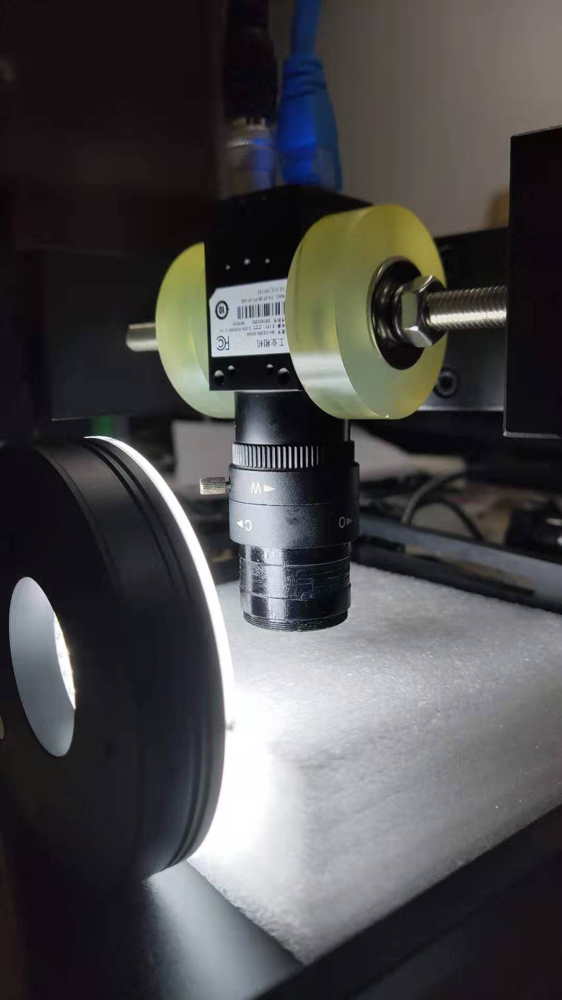
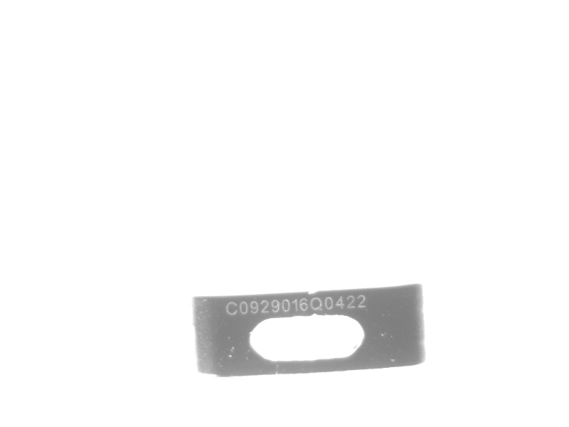
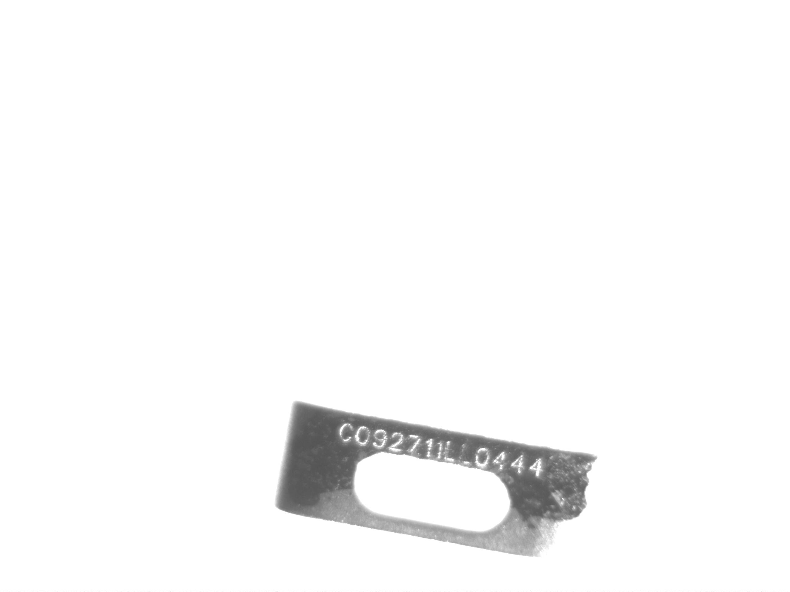
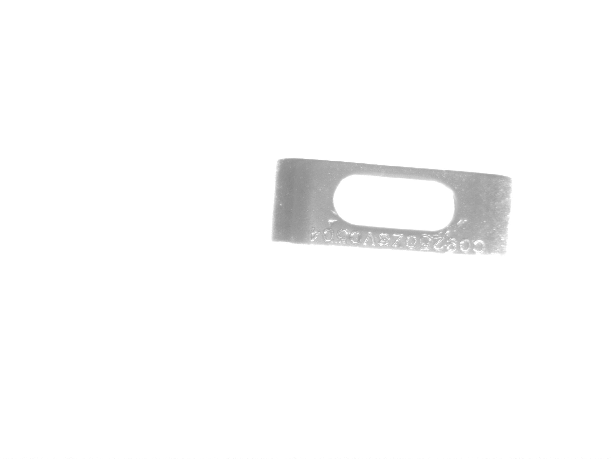
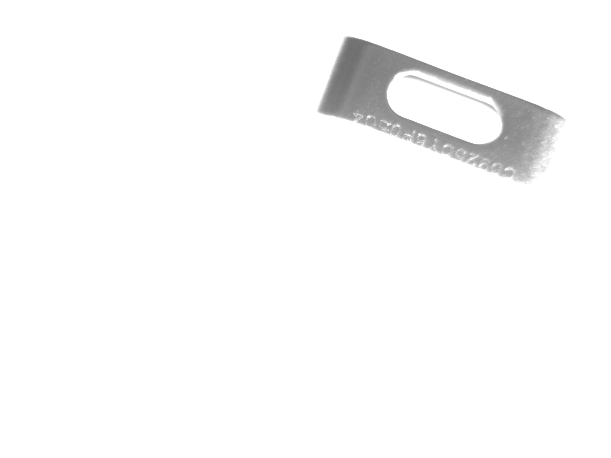

<!--
+++
title       = "金属件OCR字符识别"
description = ""
date        = "2020-12-21"
weight      = 5
tags        = []
categories  = []
keywords    = []
+++ -->

[TOC]

## 样品

+ 工件尺寸：5x1.75mm
+ 文字尺寸：字符高度不足0.5mm

肉眼根本看不出来上面有字。即使有目的的去找，也只能看到一点点很不明显的斑驳凹凸。

## 硬件配置

### 相机

由于字符尺寸很小，选用了500万像素工业相机，且不支持动态识别（如此细小的尺寸，任何晃动都会造成图像的模糊，文字不可辨）。

### 镜头

+ 选用了微焦镜头，用于放大图像。但这样焦距很近，几乎把镜头贴在了物件上
+ 或者选用显微镜头，可以把距离调的更远。

### 光源

字符是蚀刻的，所以不用怀疑，采用暗场环境照明即可。

所以需要<45度的斜向光源照明。

### 支撑垫

使用到一块白色塑料板做支撑垫，效果很好。由于白色的反光，使得整个背景都被反射成了白茫茫一片，排除了干扰和噪点。

## 调用效果

当然，更多的是蚀刻不合格，位置不居中，或者因为细微的划痕而干扰了文字反光面的零件。

